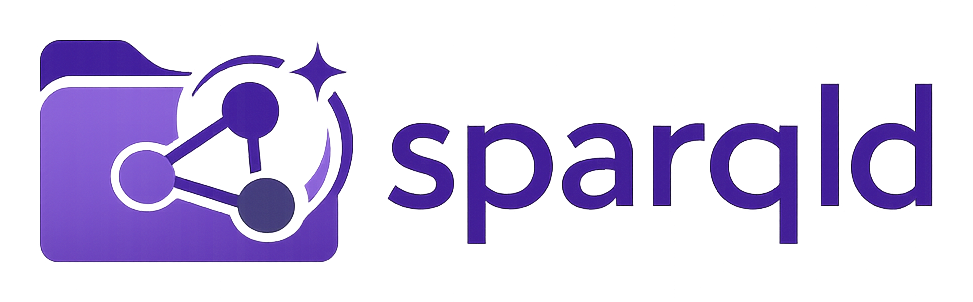

---
"@context":
  schema: https://schema.org/
  name: schema:name
  title: schema:headline
  description: schema:description
"@id": index.md
"@type": schema:SoftwareApplication
icon: material/folder-search-outline
hide: [toc]
name: sparqld
title: sparqld
description: A live, read-only SPARQL endpoint for linked data stored in files.
---

# :material-folder-search-outline: SPARQL for RDF files

`sparqld` turns a directory of RDF files into a live, read-only SPARQL
endpoint. Keep your data in version control and query its current state without
importing it into a database.

-   :material-folder-multiple:{ .lg .middle } **Files stay authoritative**

    ---

    Use Markdown-LD, YAML-LD, JSON-LD, and the rest of your repository as the
    source of truth.

-   :material-sync:{ .lg .middle } **Queries stay current**

    ---

    `sparqld` watches the directory and makes each successful edit available
    atomically.

-   :material-shield-lock-outline:{ .lg .middle } **Safe for people and agents**

    ---

    The endpoint is permanently read-only: queries explore the knowledge base
    without changing its files.

## :material-server-outline: A local endpoint in one command

{{ command('sparqld ./data') }}

The directory is served at `http://127.0.0.1:7737/`. Query it from your shell,
application, or coding agent; edit the files to change the data.

[:material-rocket-launch-outline: Start the Quickstart](quickstart.md){ .md-button .md-button--primary }
[:material-book-open-page-variant-outline: Browse the reference](reference/index.md){ .md-button }

## :material-robot-outline: A queryable knowledge base for agents

Give an agent the local endpoint and it can inspect the same versioned knowledge
base that you edit. `sparqld` fits repositories that need reproducible RDF,
fast feedback, and a clear boundary between querying and changing data.

It is useful for:

- local knowledge bases and ontology repositories;
- generated RDF build output and application fixtures;
- documentation projects and agents that need to query their working data.

No database service, import script, or synchronization layer is required.
