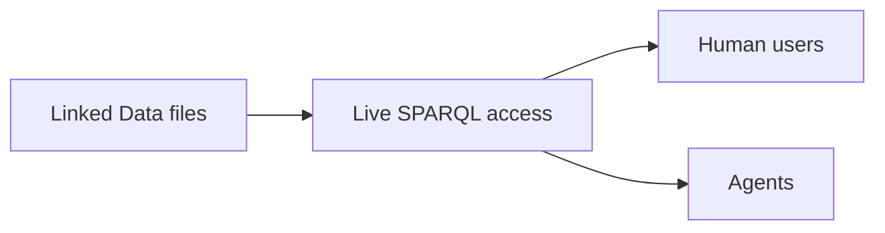

# Implement live file-backed SPARQL access with sparqld

{{ adr_metadata(date, status) }}

## :material-text-box-outline: Context

Linked Data files need direct SPARQL access for human users and agents; files
remain authoritative and edits become available live. This decision compares
solutions that do not require operating a separately loaded triple store.

## :material-arrow-decision-outline: Decision

<table data-adr-comparison markdown="1">
  <tr markdown="span">
    <th>Alternative</th>
    <th>Direct file access</th>
    <th>Live reload</th>
    <th>[SPARQL endpoint](https://www.w3.org/TR/sparql11-protocol/)</th>
    <th>[YAML-LD](https://www.w3.org/TR/yaml-ld-10/)</th>
    <th>[Markdown-LD](/reference/formats/)</th>
    <th>[GitHub stars](https://docs.github.com/en/get-started/exploring-projects-on-github/saving-repositories-with-stars)</th>
    <th>Latest release</th>
  </tr>
  <tr markdown="span">
    <th class="chosen">[:fontawesome-brands-github: `iolanta-tech/sparqld`](https://github.com/iolanta-tech/sparqld)</th>
    <td class="chosen">[:white_check_mark:](/ "Reads served files directly")</td>
    <td class="chosen">[:white_check_mark:](/reference/agents/ "Watches for file changes")</td>
    <td class="chosen">[:white_check_mark:](/reference/api/ "Provides a SPARQL HTTP endpoint")</td>
    <td class="chosen">[:white_check_mark:](/reference/formats/ "Supports YAML-LD")</td>
    <td class="chosen">[:white_check_mark:](/reference/formats/ "Supports Markdown-LD")</td>
    <td class="chosen">[0](https://github.com/iolanta-tech/sparqld/stargazers "Observed 2026-08-07")</td>
    <td class="chosen">[0.1.1 2026-08-07](https://crates.io/crates/sparqld/0.1.1 "Released 2026-08-07")</td>
  </tr>
  <tr markdown="span">
    <th class="excl">[SPARQL Anything](https://sparql-anything.cc/)</th>
    <td class="excl">[:white_check_mark:](https://sparql-anything.readthedocs.io/stable/ "Queries local files directly")</td>
    <td class="excl">[:warning:](https://sparql-anything.readthedocs.io/stable/ "Processes local files per query; no documented watcher")</td>
    <td class="excl">[:white_check_mark:](https://sparql-anything.readthedocs.io/stable/ "Provides an HTTP endpoint")</td>
    <td class="excl hot">[:x:](https://sparql-anything.readthedocs.io/stable/formats/YAML/ "YAML support is not YAML-LD")</td>
    <td class="excl hot">[:x:](https://sparql-anything.readthedocs.io/stable/formats/Markdown/ "Markdown support is not Markdown-LD")</td>
    <td class="excl">[302](https://github.com/SPARQL-Anything/sparql.anything/stargazers "Observed 2026-08-07")</td>
    <td class="excl">[v1.2.0 2026-07-24](https://github.com/SPARQL-Anything/sparql.anything/releases/tag/v1.2.0 "Released 2026-07-24")</td>
  </tr>
  <tr markdown="span">
    <th class="excl">[Apache Jena Fuseki](https://jena.apache.org/documentation/fuseki2/)</th>
    <td class="excl hot">[:x:](https://jena.apache.org/documentation/fuseki2/fuseki-server.html "Loads a file at startup")</td>
    <td class="excl">[:x:](https://jena.apache.org/documentation/fuseki2/fuseki-server.html "No live reload documented")</td>
    <td class="excl">[:white_check_mark:](https://jena.apache.org/documentation/fuseki2/fuseki-server.html "Provides a SPARQL HTTP endpoint")</td>
    <td class="excl">[:x:](https://jena.apache.org/documentation/fuseki2/fuseki-server.html "YAML-LD input is not documented")</td>
    <td class="excl">[:x:](https://jena.apache.org/documentation/fuseki2/fuseki-server.html "Markdown-LD input is not documented")</td>
    <td class="excl">[1,398](https://github.com/apache/jena/stargazers "Observed 2026-08-07")</td>
    <td class="excl">[6.1.0 2026-05-03](https://central.sonatype.com/artifact/org.apache.jena/jena-fuseki-main/6.1.0 "Released 2026-05-03")</td>
  </tr>
  <tr markdown="span">
    <th class="excl">[Oxigraph server](https://docs.rs/oxigraph_server/latest/oxigraph_server/)</th>
    <td class="excl hot">[:x:](https://docs.rs/crate/oxigraph_server/0.3.4 "Bulk-loads data into storage")</td>
    <td class="excl">[:x:](https://docs.rs/crate/oxigraph_server/0.3.4 "No live reload documented")</td>
    <td class="excl">[:white_check_mark:](https://docs.rs/crate/oxigraph_server/0.3.4 "Provides a SPARQL HTTP endpoint")</td>
    <td class="excl">[:x:](https://docs.rs/oxigraph/latest/oxigraph/io/enum.RdfFormat.html "YAML-LD is not an RDF format")</td>
    <td class="excl">[:x:](https://docs.rs/oxigraph/latest/oxigraph/io/enum.RdfFormat.html "Markdown-LD is not an RDF format")</td>
    <td class="excl">[1,801](https://github.com/oxigraph/oxigraph/stargazers "Observed 2026-08-07")</td>
    <td class="excl">[v0.5.9 2026-06-18](https://github.com/oxigraph/oxigraph/releases/tag/v0.5.9 "Released 2026-06-18")</td>
  </tr>
  <tr markdown="span">
    <th class="excl">[RDF4J Server](https://rdf4j.org/documentation/tools/server-workbench/)</th>
    <td class="excl hot">[:x:](https://rdf4j.org/documentation/programming/repository/ "Loads local RDF files into a repository")</td>
    <td class="excl">[:x:](https://rdf4j.org/documentation/tools/server-workbench/ "No live reload documented")</td>
    <td class="excl">[:white_check_mark:](https://rdf4j.org/documentation/tools/server-workbench/ "Provides a SPARQL HTTP endpoint")</td>
    <td class="excl">[:x:](https://rdf4j.org/documentation/tools/server-workbench/ "YAML-LD input is not documented")</td>
    <td class="excl">[:x:](https://rdf4j.org/documentation/tools/server-workbench/ "Markdown-LD input is not documented")</td>
    <td class="excl">[409](https://github.com/eclipse-rdf4j/rdf4j/stargazers "Observed 2026-08-07")</td>
    <td class="excl">[5.3.2 2026-06-29](https://github.com/eclipse-rdf4j/rdf4j/releases/tag/5.3.2 "Released 2026-06-29")</td>
  </tr>
  <tr markdown="span">
    <th class="excl">[Comunica over local RDF files](https://comunica.dev/)</th>
    <td class="excl">[:white_check_mark:](https://comunica.dev/docs/query/getting_started/query_cli_file/ "Queries local RDF files directly")</td>
    <td class="excl">[:warning:](https://comunica.dev/docs/query/getting_started/query_cli_file/ "Reads local files again on each query; no watcher")</td>
    <td class="excl">[:white_check_mark:](https://comunica.dev/docs/query/getting_started/setup_endpoint/ "Provides an HTTP endpoint")</td>
    <td class="excl hot">[:x:](https://comunica.dev/docs/query/getting_started/query_cli_file/ "YAML-LD input is not documented")</td>
    <td class="excl hot">[:x:](https://comunica.dev/docs/query/getting_started/query_cli_file/ "Markdown-LD input is not documented")</td>
    <td class="excl">[577](https://github.com/comunica/comunica/stargazers "Observed 2026-08-07")</td>
    <td class="excl">[v5.3.0 2026-07-10](https://github.com/comunica/comunica/releases/tag/v5.3.0 "Released 2026-07-10")</td>
  </tr>
  <tr markdown="span">
    <th class="excl">[Apache Jena ARQ](https://jena.apache.org/documentation/query/cmds.html)</th>
    <td class="excl">[:white_check_mark:](https://jena.apache.org/documentation/query/cmds.html "Queries RDF files directly")</td>
    <td class="excl">[:warning:](https://jena.apache.org/documentation/query/cmds.html "Rerunning reads a changed file; no watcher")</td>
    <td class="excl hot">[:x:](https://jena.apache.org/documentation/query/cmds.html "Does not provide an HTTP endpoint")</td>
    <td class="excl">[:x:](https://jena.apache.org/documentation/query/cmds.html "YAML-LD input is not documented")</td>
    <td class="excl">[:x:](https://jena.apache.org/documentation/query/cmds.html "Markdown-LD input is not documented")</td>
    <td class="excl">[1,398](https://github.com/apache/jena/stargazers "Observed 2026-08-07")</td>
    <td class="excl">[6.1.0 2026-05-03](https://central.sonatype.com/artifact/org.apache.jena/jena-arq/6.1.0 "Released 2026-05-03")</td>
  </tr>
  <tr markdown="span">
    <th class="excl">[:fontawesome-brands-github: `fabio-rovai/open-ontologies`](https://github.com/fabio-rovai/open-ontologies)</th>
    <td class="excl hot">[:x:](https://github.com/fabio-rovai/open-ontologies "Uses an in-memory Oxigraph triple store")</td>
    <td class="excl">[:x:](https://github.com/fabio-rovai/open-ontologies "No live reload documented")</td>
    <td class="excl">[:x:](https://github.com/fabio-rovai/open-ontologies "Its serve command is JSON-RPC over standard input and output")</td>
    <td class="excl">[:x:](https://github.com/fabio-rovai/open-ontologies "YAML-LD input is not documented")</td>
    <td class="excl">[:x:](https://github.com/fabio-rovai/open-ontologies "Markdown-LD input is not documented")</td>
    <td class="excl">[353](https://github.com/fabio-rovai/open-ontologies/stargazers "Observed 2026-08-07")</td>
    <td class="excl">[v1.1.1 2026-08-05](https://github.com/fabio-rovai/open-ontologies/releases/tag/v1.1.1 "Released 2026-08-05")</td>
  </tr>
</table>

Green row: chosen, meets every requirement. Red row: excluded, fails one or more required capabilities; stronger-red cells are the disqualifying capability. :warning: re-querying reflects a changed file but there is no watcher.

## :material-arrow-right-bold-outline: Consequences

- Work proceeds on sparqld as the selected live file-backed SPARQL access product.
