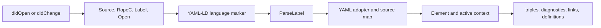

# Build on SWLS

{{ universe_metadata('index.md', status) }}

This planning path uses SWLS as the LSP foundation and extends it for YAML-LD and Markdown-LD. “Universe” is planning shorthand for the consequences of committing to this foundation.

[:fontawesome-brands-github: `SemanticWebLanguageServer/swls`](https://github.com/SemanticWebLanguageServer/swls) is a Rust LSP that already supports JSON-LD alongside Turtle, TriG, and SPARQL.

## :material-code-json: JSON-LD parser

SWLS directly uses [`rdf-parsers` 0.1.16](https://crates.io/crates/rdf-parsers/0.1.16): its JSON-LD language implementation [:fontawesome-brands-github: `mod.rs`](https://github.com/SemanticWebLanguageServer/swls/blob/main/lang-jsonld/src/ecs/mod.rs) calls `parse_incremental` to retain a lossless concrete syntax tree, then `convert_with_loader` to obtain the semantic model and active context. OxJSONLD [:fontawesome-brands-github: `oxigraph/oxigraph`](https://github.com/oxigraph/oxigraph/tree/main/lib/oxjsonld) appears elsewhere among SWLS’s resolved dependencies, but is not its direct JSON-LD parser.

## :material-rocket-launch-outline: First release

!!! info "YAML-LD only"
    The first release supports YAML-LD. Markdown-LD extraction and range translation are follow-up work.

### :material-map-marker-path: SWLS execution path

[:fontawesome-brands-github: `backend.rs`](https://github.com/SemanticWebLanguageServer/swls/blob/main/core/src/backend.rs) handles `didOpen` by creating a document entity with `Source`, `RopeC`, `Label`, `Open`, and other generic components. The resulting `CreateEvent` lets a registered language attach its marker; the parse schedule then runs. On `didChange`, SWLS replaces only `Source` and `RopeC` before running that same schedule again. The JSON-LD language system parses changed open documents, converts the syntax tree into an `Element` and active context, then reruns the shared derivation schedule [:fontawesome-brands-github: `mod.rs`](https://github.com/SemanticWebLanguageServer/swls/blob/main/lang-jsonld/src/ecs/mod.rs). Go to Definition injects the cursor position into a separate request schedule, which searches every document’s derived triples and maps matching subject spans back through `RopeC` [:fontawesome-brands-github: `goto_definition.rs`](https://github.com/SemanticWebLanguageServer/swls/blob/main/core/src/feature/goto_definition.rs).

### :material-graph-outline: Establish the extension boundary

- [ ] Record the reusable generic components—`Source`, `RopeC`, `Label`, `Open`, `Dirty`, and `Element`—and the JSON-LD-specific marker and active-context components [:fontawesome-brands-github: `document.rs`](https://github.com/SemanticWebLanguageServer/swls/blob/main/core/src/components/document.rs).
- [ ] Define a `YamlLdLang` marker, a YAML-LD source-map component, and a parse system whose output is the shared `Element` model plus JSON-LD active context.
- [ ] Register the YAML-LD language identifier and file association using the existing language-registration path [:fontawesome-brands-github: `lib.rs`](https://github.com/SemanticWebLanguageServer/swls/blob/main/lang-rdf-base/src/lib.rs).
- [ ] Prove that opening and fully replacing a minimal YAML-LD document creates and updates the YAML-LD entity without changing existing JSON-LD behaviour.

### :material-file-tree-outline: Map YAML-LD source

- [ ] Parse YAML while retaining key and scalar spans.
- [ ] Convert the YAML structure to the JSON-LD-shaped input required by the semantic layer, recording a mapping from each resulting JSON-LD value path to its YAML source span.
- [ ] Route YAML syntax, conversion, and JSON-LD semantic diagnostics through that map, so the editor never reports a position in generated JSON text.

### :material-link-variant: Derive link semantics

- [ ] Pass the mapped YAML-LD structure through SWLS’s existing JSON-LD conversion, which already applies [type coercion to `@id`](https://www.w3.org/TR/json-ld11/#type-coercion); record which converted values are IRIs and retain their YAML source ranges rather than reimplementing coercion.
- [ ] Add a `textDocument/documentLink` result path for those mapped IRI ranges, resolving each target against the document base. Do not reuse SWLS’s `DocumentLinks` component: it represents imported documents, not clickable value ranges.

### :material-file-find-outline: Index workspace definitions

- [ ] Build or extend the workspace index so each IRI definition retains its document URI and mapped source range.
- [ ] Extend SWLS’s go-to-definition request path [:fontawesome-brands-github: `backend.rs`](https://github.com/SemanticWebLanguageServer/swls/blob/main/core/src/backend.rs) to return every workspace definition matching an IRI-valued link.
- [ ] Recompute the derived graph, source map, links, and definition index from authoritative in-memory text on open and full-document change notifications, before a disk scan can overwrite unsaved state.

### :material-test-tube: Release evidence

- [ ] Add end-to-end fixtures through SWLS’s LSP feature test harness [:fontawesome-brands-github: `SemanticWebLanguageServer/swls`](https://github.com/SemanticWebLanguageServer/swls/tree/main/e2e) for YAML-LD diagnostic ranges, `@type: @id` links, relative cross-file resolution, multiple definitions, and unsaved edits.
- [ ] Package the extended server and verify its editor distribution path with SWLS’s documented binary and editor integration model [:fontawesome-brands-github: `SemanticWebLanguageServer/swls`](https://github.com/SemanticWebLanguageServer/swls#installation).

## :material-clock-outline: After first release

- [ ] Define a context-loader policy that replaces or constrains SWLS’s context loader [:fontawesome-brands-github: `mod.rs`](https://github.com/SemanticWebLanguageServer/swls/blob/main/lang-jsonld/src/ecs/mod.rs), which can request HTTP contexts, then implement the selected local-context security rules and IRI resolution policy.

### :material-language-markdown-outline: Markdown-LD

- [ ] Identify YAML front matter and report malformed or missing delimiters against Markdown-document ranges.
- [ ] Feed extracted front matter through the YAML-LD mapper while translating every resulting range by the front-matter offset.
- [ ] Keep the containing Markdown document authoritative for open and unsaved-buffer updates.

## :material-call-split: Universe consequences

- Upstream changes to SWLS core and language crates [:fontawesome-brands-github: `SemanticWebLanguageServer/swls`](https://github.com/SemanticWebLanguageServer/swls/tree/main) become an ongoing compatibility and release-management concern.
- A YAML-LD source-map layer and Markdown front-matter adapter would be new language implementations alongside SWLS’s existing JSON-LD language crate [:fontawesome-brands-github: `SemanticWebLanguageServer/swls`](https://github.com/SemanticWebLanguageServer/swls/tree/main/lang-jsonld), so their parsing, semantic mapping, and tests require local maintenance.
- Replacing the current context-loading behaviour [:fontawesome-brands-github: `mod.rs`](https://github.com/SemanticWebLanguageServer/swls/blob/main/lang-jsonld/src/ecs/mod.rs) risks duplicating or diverging from upstream JSON-LD conversion and navigation logic.
