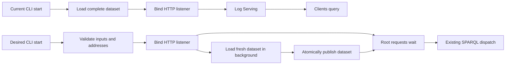

# Serve SPARQL endpoint when its initial dataset is ready

{{ adr_metadata(date, status) }}

## :material-text-box-outline: Context

CI starts `sparqld --no-watch` over a directory of EARL Turtle reports and
then runs several queries against that one dataset. Today,
[`serve_at_with_options`](https://github.com/iolanta-tech/sparqld/blob/f3b935f/src/lib.rs#L66-L100)
loads the complete dataset before it resolves and binds the HTTP addresses, and
logs `Serving … at …` only afterwards. That makes a client infer readiness from
a human-readable log line before it can reuse the loaded dataset.

The existing loader builds a fresh store and replaces the shared store only
after the complete load finishes
([`reload_dataset`](https://github.com/iolanta-tech/sparqld/blob/f3b935f/src/lib.rs#L115-L128)).
When watching, the watcher is registered before that initial load so events
cannot be missed
([`DirectoryWatcher::start_with_patterns`](https://github.com/iolanta-tech/sparqld/blob/f3b935f/src/watcher.rs#L95-L126)).
The decision must retain those properties while giving CI and long-running
clients an endpoint-level startup contract.

## :material-arrow-decision-outline: Decision

<table data-adr-comparison markdown="1">
  <caption>Startup alternatives compared against the same directory-backed endpoint.</caption>
  <tr markdown="span">
    <th>Criterion</th>
    <th class="chosen">2. Bind; wait at ordinary requests</th>
    <th class="not-selected">3. Bind; return 503 + readiness route</th>
    <th class="excl">1. Load before binding</th>
    <th class="excl">4. Load before binding + ready signal</th>
    <th class="excl">5. Batch multi-query mode</th>
  </tr>
  <tr markdown="span">
    <th>Parse shared dataset once</th>
    <td class="chosen">:white_check_mark: [One initial load serves every request](https://github.com/iolanta-tech/sparqld/blob/f3b935f/src/lib.rs#L115-L128).</td>
    <td class="not-selected">:white_check_mark: [One initial load serves every request](https://github.com/iolanta-tech/sparqld/blob/f3b935f/src/lib.rs#L115-L128).</td>
    <td class="excl">:white_check_mark: [One loaded store serves later requests](https://github.com/iolanta-tech/sparqld/blob/f3b935f/src/lib.rs#L76-L100).</td>
    <td class="excl">:white_check_mark: [One loaded store serves later requests](https://github.com/iolanta-tech/sparqld/blob/f3b935f/src/lib.rs#L76-L100).</td>
    <td class="excl">:white_check_mark: Could reuse one load within a new batch interface.</td>
  </tr>
  <tr markdown="span">
    <th>Correct results while loading</th>
    <td class="chosen">:white_check_mark: [Dispatch follows atomic first publication](https://github.com/iolanta-tech/sparqld/blob/f3b935f/src/lib.rs#L120-L128).</td>
    <td class="not-selected">:white_check_mark: [503 explicitly declines service while unavailable](https://www.rfc-editor.org/rfc/rfc9110#section-15.6.4).</td>
    <td class="excl">:white_check_mark: [No request can arrive before binding](https://github.com/iolanta-tech/sparqld/blob/f3b935f/src/lib.rs#L76-L100).</td>
    <td class="excl">:white_check_mark: [No request can arrive before binding](https://github.com/iolanta-tech/sparqld/blob/f3b935f/src/lib.rs#L76-L100).</td>
    <td class="excl">:white_check_mark: A process-local batch could query after its load.</td>
  </tr>
  <tr markdown="span">
    <th>CI and deployment ergonomics</th>
    <td class="chosen">:white_check_mark: The first normal query is the readiness wait.</td>
    <td class="not-selected">:warning: Requires a client retry or polling policy after `503`.</td>
    <td class="excl hot">:x: [Clients need an out-of-band availability check](https://github.com/iolanta-tech/sparqld/blob/f3b935f/src/lib.rs#L97-L100).</td>
    <td class="excl hot">:warning: Requires defining a separate process-signal contract.</td>
    <td class="excl hot">:x: Does not start the existing HTTP service.</td>
  </tr>
  <tr markdown="span">
    <th>Health, readiness, and liveness</th>
    <td class="chosen">:warning: Readiness is expressed by the normal endpoint, not a probe route.</td>
    <td class="not-selected">:white_check_mark: [A readiness probe can remove an unready service from traffic](https://kubernetes.io/docs/concepts/configuration/liveness-readiness-startup-probes/).</td>
    <td class="excl">:warning: [A listening port implies only post-load availability](https://github.com/iolanta-tech/sparqld/blob/f3b935f/src/lib.rs#L76-L100).</td>
    <td class="excl">:warning: A signal needs its own health-semantics contract.</td>
    <td class="excl">:x: Provides no long-running endpoint for probes.</td>
  </tr>
  <tr markdown="span">
    <th>Timeout, cancellation, and failure</th>
    <td class="chosen">:white_check_mark: Each client keeps its HTTP deadline; shared loading remains independent.</td>
    <td class="not-selected">:white_check_mark: [503 communicates temporary unavailability](https://www.rfc-editor.org/rfc/rfc9110#section-15.6.4).</td>
    <td class="excl">:warning: [Connection failures reveal no initialization outcome](https://github.com/iolanta-tech/sparqld/blob/f3b935f/src/lib.rs#L88-L100).</td>
    <td class="excl">:warning: Signal consumers need a defined failure and timeout protocol.</td>
    <td class="excl">:warning: A separate input protocol must define batch cancellation and errors.</td>
  </tr>
  <tr markdown="span">
    <th>Live reload and atomic replacement</th>
    <td class="chosen">:white_check_mark: [Retains pre-load watch registration and atomic replacement](https://github.com/iolanta-tech/sparqld/blob/f3b935f/src/watcher.rs#L95-L126).</td>
    <td class="not-selected">:white_check_mark: [Can retain the same watcher and replacement model](https://github.com/iolanta-tech/sparqld/blob/f3b935f/src/watcher.rs#L95-L126).</td>
    <td class="excl">:white_check_mark: [Current model already preserves both](https://github.com/iolanta-tech/sparqld/blob/f3b935f/src/watcher.rs#L95-L126).</td>
    <td class="excl">:white_check_mark: [Current model already preserves both](https://github.com/iolanta-tech/sparqld/blob/f3b935f/src/watcher.rs#L95-L126).</td>
    <td class="excl hot">:x: [A one-shot mode cannot supply live reload](https://github.com/iolanta-tech/sparqld/blob/f3b935f/src/main.rs#L46-L48).</td>
  </tr>
  <tr markdown="span">
    <th>Implementation complexity and API stability</th>
    <td class="chosen">:white_check_mark: Adds one internal readiness gate while retaining `/`.</td>
    <td class="not-selected">:warning: [Adds endpoint and retry contract beyond the existing `/` API](https://github.com/iolanta-tech/sparqld/blob/f3b935f/docs/reference/api/index.md#L13-L30).</td>
    <td class="excl">:white_check_mark: [Preserves the current startup order](https://github.com/iolanta-tech/sparqld/blob/f3b935f/src/lib.rs#L76-L100).</td>
    <td class="excl">:warning: Adds a separate readiness-output contract.</td>
    <td class="excl">:warning: Adds a second query-supply interface.</td>
  </tr>
  <tr markdown="span">
    <th>Outcome</th>
    <td class="chosen">:white_check_mark: Chosen</td>
    <td class="not-selected">:material-minus-circle-outline: Not selected</td>
    <td class="excl">:x: Excluded — preserves log-coupled startup</td>
    <td class="excl">:x: Excluded — adds out-of-band coordination</td>
    <td class="excl">:x: Excluded — does not improve server startup</td>
  </tr>
</table>

Green column: chosen. Yellow column: satisfies the core constraints but was
not selected. Red columns: excluded; stronger-red cells identify the decisive
shortcoming. :warning: denotes a trade-off. The HTTP [SPARQL Protocol](https://www.w3.org/TR/sparql11-protocol/)
defines query request forms, while [Kubernetes probes](https://kubernetes.io/docs/concepts/configuration/liveness-readiness-startup-probes/)
distinguish traffic readiness from liveness; sparqld deliberately adds neither
`/readyz` nor `/livez`, so both continue to be ordinary unknown paths (`404`)
under the [root-only handler](https://github.com/iolanta-tech/sparqld/blob/f3b935f/src/server.rs#L43-L46).

Bind the listener immediately after synchronous validation of the directory,
patterns, and resolved addresses. Start the initial load in the background.
Until that load reaches a terminal state, every `GET` or `POST` request at `/`,
including the landing `GET /`, waits without a server-imposed deadline. It is
then passed to the [existing root-only request dispatch](https://github.com/iolanta-tech/sparqld/blob/f3b935f/src/server.rs#L43-L87).

On success, atomically publish the fresh dataset, release all waiting requests,
and run their normal dispatch. Per-file parse errors remain nonfatal: the
[catalog already records them](https://github.com/iolanta-tech/sparqld/blob/f3b935f/src/loader.rs#L353-L400),
so that completed load is ready. A client timeout or disconnect cancels only
that request, never the shared load or another waiter. On a fatal initialization
failure, pending and subsequent root requests receive
[`503 Service Unavailable`](https://www.rfc-editor.org/rfc/rfc9110#section-15.6.4),
then sparqld shuts down and exits nonzero without a successful `Serving` log.
Other paths return `404` immediately. After readiness, live reload never
re-gates requests and retains staged atomic replacement.

Logs remain informative for people and diagnostics, not a client readiness
contract. The existing `Serving … at …` line remains after readiness for
compatibility.

## :material-arrow-right-bold-outline: Consequences

- Clients can issue their first ordinary query immediately after starting
  sparqld, with a client-side timeout appropriate to their CI or deployment.
- The CLI flags, library function signatures, SPARQL request forms, responses,
  and non-root `404` behavior remain stable; only the startup timing changes.
- Release notes document that log parsing is unnecessary and that an immediate
  root request waits for the initial dataset rather than inferring readiness
  from the listener or logs.

#### Implementation Steps

- [ ] Add an internal, shared initial-load state that wakes all root-request
  waiters after success or fatal failure.
- [ ] Bind only after validation, begin the initial load in the background, and
  preserve watcher registration before the first load.
- [ ] Dispatch root requests only after successful first publication; return
  `503` after fatal initialization and stop the listener before nonzero exit.
- [ ] Document the startup contract in the HTTP API and CLI guidance without
  introducing a health endpoint.
- [ ] Test listener reachability during load, concurrent `GET` and `POST`
  waiters, atomic complete-dataset results, nonfatal file errors, independent
  client cancellation, fatal-load `503` and exit, absent probe paths, and
  post-ready atomic live reload.
