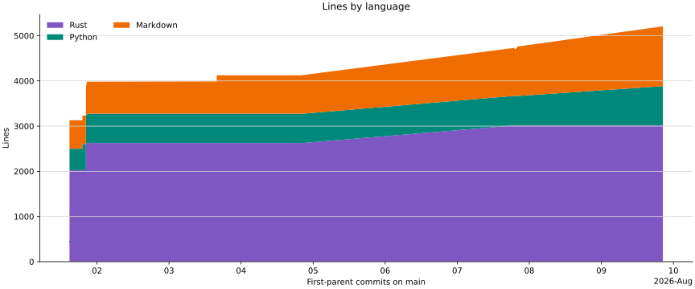

---
"@context":
  schema: https://schema.org/
  name: schema:name
  title: schema:headline
  description: schema:description
"@id": project/index.md
"@type": schema:TechArticle
icon: material/source-repository
hide: [toc]
name: sparqld project
title: Project
description: Release, source, licensing, and development information for sparqld.
---

# :material-source-repository: Project

## Intended audience

Developers maintaining a file-based local Linked Data knowledge base who want
safe, immediate SPARQL access for themselves and their agents, without
operating a database.

`sparqld` 0.1.4 is an early release for local, file-backed SPARQL access.

-   :material-sign-direction:{ .lg .middle } **Architecture decisions**

    ---

    Review the decisions that shape the project.

    [:octicons-arrow-right-24: Decisions](decisions/index.md)

-   :material-tag-outline:{ .lg .middle } **Release and requirements**

    ---

    Version 0.1.4 · Rust 1.88 or later with Cargo

-   :material-source-repository:{ .lg .middle } **Source and issues**

    ---

    [:fontawesome-brands-github: Repository](https://github.com/iolanta-tech/sparqld) ·
    [:octicons-issue-opened-24: Issues](https://github.com/iolanta-tech/sparqld/issues)

-   :material-scale-balance:{ .lg .middle } **License**

    ---

    [Apache-2.0](https://github.com/iolanta-tech/sparqld/blob/main/LICENSE-APACHE)
    OR [MIT](https://github.com/iolanta-tech/sparqld/blob/main/LICENSE-MIT)

-   :material-map-marker-path:{ .lg .middle } **Roadmap**

    ---

    [Planned work](roadmap.md) and current limitations.

## Lines by language

Rust and Python code lines, plus Markdown content lines, at each first-parent
commit on `main`.

