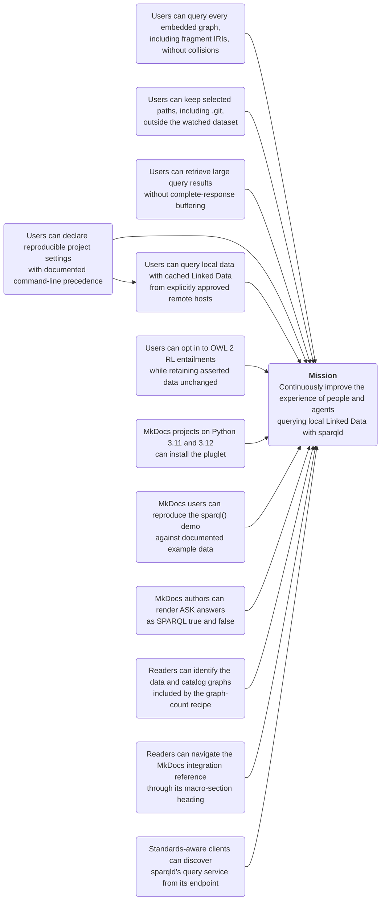

---
"@context":
  schema: https://schema.org/
  name: schema:name
  title: schema:headline
  description: schema:description
  datePublished: schema:datePublished
"@id": project/roadmap.md
"@type": schema:TechArticle
name: sparqld roadmap
hide: [toc]
title: Roadmap
description: Achievable outcomes that advance sparqld's mission.
datePublished: 2026-08-14
---

# :material-map-marker-path: Roadmap

Arrows point from a blocking outcome to the outcome it enables. The mission is
an enduring direction rather than a completion criterion.

