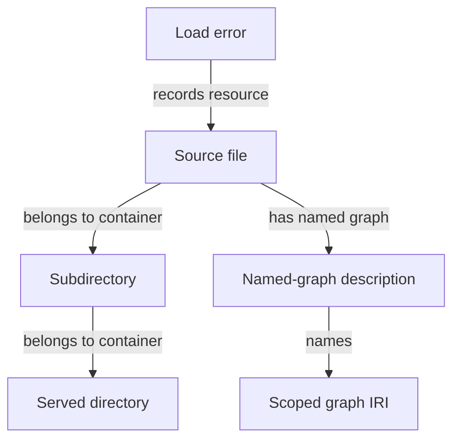

---
"@context":
  schema: https://schema.org/
  name: schema:name
  title: schema:headline
  description: schema:description
"@id": reference/file-catalog.md
"@type": schema:TechArticle
name: File catalog
title: File catalog
description: The metadata sparqld maintains about the served directory and its graphs.
---

# :material-folder-multiple: File catalog

The reserved `sparqld:` graph describes the served directory. It lets queries
relate data to the files and directories from which it came.

| Resource | RDF types | Properties |
| --- | --- | --- |
| Served directory | [`nfo:FileDataObject`](https://www.semanticdesktop.org/ontologies/2007/03/22/nfo/#FileDataObject), [`nfo:Folder`](https://www.semanticdesktop.org/ontologies/2007/03/22/nfo/#Folder) | [`nfo:fileName`](https://www.semanticdesktop.org/ontologies/2007/03/22/nfo/#fileName) |
| Nested directory | [`nfo:FileDataObject`](https://www.semanticdesktop.org/ontologies/2007/03/22/nfo/#FileDataObject), [`nfo:Folder`](https://www.semanticdesktop.org/ontologies/2007/03/22/nfo/#Folder) | [`nfo:fileName`](https://www.semanticdesktop.org/ontologies/2007/03/22/nfo/#fileName), [`nfo:belongsToContainer`](https://www.semanticdesktop.org/ontologies/2007/03/22/nfo/#belongsToContainer) |
| Source file with embedded graphs | [`nfo:FileDataObject`](https://www.semanticdesktop.org/ontologies/2007/03/22/nfo/#FileDataObject), [`sd:Dataset`](http://www.w3.org/ns/sparql-service-description#Dataset) | [`nfo:fileName`](https://www.semanticdesktop.org/ontologies/2007/03/22/nfo/#fileName), [`nfo:belongsToContainer`](https://www.semanticdesktop.org/ontologies/2007/03/22/nfo/#belongsToContainer), [`sd:namedGraph`](http://www.w3.org/ns/sparql-service-description#namedGraph) |
| Named-graph description | [`sd:NamedGraph`](http://www.w3.org/ns/sparql-service-description#NamedGraph) | [`sd:name`](http://www.w3.org/ns/sparql-service-description#name) |
| Load error | [`rlog:Entry`](http://persistence.uni-leipzig.org/nlp2rdf/ontologies/rlog#Entry) | [`rlog:resource`](http://persistence.uni-leipzig.org/nlp2rdf/ontologies/rlog#resource) |

The source resource IRI is also its named graph IRI. The catalog is updated
when source files are created, moved, or deleted.

## :material-graph-outline: Embedded graphs

For every embedded graph, the catalog uses
[`sd:namedGraph`](https://www.w3.org/TR/sparql12-service-description/#sd-namedGraph)
to link the source dataset to an [`sd:NamedGraph`](http://www.w3.org/ns/sparql-service-description#NamedGraph) description. Its [`sd:name`](http://www.w3.org/ns/sparql-service-description#name) is
the scoped graph IRI. This is the SPARQL Service Description vocabulary's
specific model for named graphs in a dataset.

## :material-database-search-outline: Query the catalog

This query lists every source file and its declared embedded graphs. A source
without embedded graphs has an empty `?graph` value.

{{ source('docs/queries/file-catalog.rq') }}
