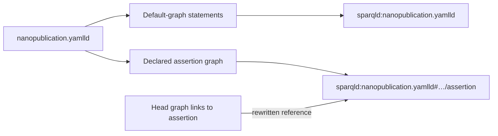

---
"@context":
  schema: https://schema.org/
  name: schema:name
  title: schema:headline
  description: schema:description
"@id": reference/named-graphs.md
"@type": schema:TechArticle
hide: [toc]
name: Named graphs
title: Named graphs
description: How sparqld assigns source and embedded named graphs.
---

# :material-source-branch: Named graphs

`sparqld` preserves the boundary between files by loading every source into its
own named graph. When a source declares further named graphs, they remain
separate and are scoped to that source file.

-   :material-file-document-outline:{ .lg .middle } **Source graph**

    ---

    Its IRI is `sparqld:` followed by the source path relative to the served
    directory.

-   :material-set-merge:{ .lg .middle } **Default graph**

    ---

    Queries without `GRAPH` see the union of every named graph, including the
    file catalog.

-   :material-graph-outline:{ .lg .middle } **Embedded graph**

    ---

    A graph declared inside a source is named with the source graph IRI,
    followed by `#` and its original graph name.

## :material-link-variant: Graph IRIs

This documentation site is itself served with `sparqld`, so paths are relative
to the served `docs/` directory. For the tangible
[`examples/`](https://github.com/iolanta-tech/sparqld/tree/main/docs/examples)
directory inside it:

| Source path | Named graph |
| --- | --- |
| `examples/alpha-centauri.yamlld` | `sparqld:examples/alpha-centauri.yamlld` |
| `examples/centaurus.md` | `sparqld:examples/centaurus.md` |
| `examples/proxima-centauri-b.jsonld` | `sparqld:examples/proxima-centauri-b.jsonld` |

Paths always use `/` as the separator, and characters that cannot appear
literally in the graph IRI are percent-encoded. Renaming or moving a source
therefore gives it a new graph IRI.

Use `GRAPH` to retain source provenance in query results:

{{ query_data('all-quads.rq') }}

## :material-file-tree: Named graphs inside a source

TriG, N-Quads, JSON-LD, YAML-LD, and Markdown-LD may declare named graphs. A
source's ordinary statements stay in its source graph. Each declared graph is
scoped with the source graph IRI, so two files can use the same graph name
without colliding.

For example, an assertion graph named
`http://purl.org/nanopub/temp/np/assertion` in `nanopublication.yamlld` becomes
`sparqld:nanopublication.yamlld#http://purl.org/nanopub/temp/np/assertion`.

References to an embedded graph are rewritten to its scoped IRI too. A
nanopublication head therefore continues to point to its assertion,
provenance, and publication-info graphs after loading.

The [`File catalog`](file-catalog.md) page describes the reserved `sparqld:`
graph, which records source files, directories, and embedded graphs.
